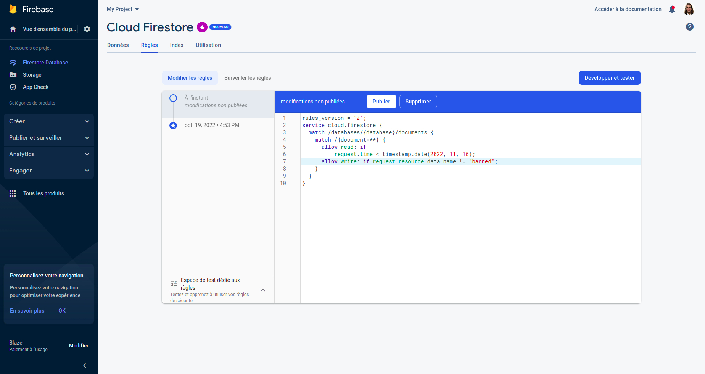
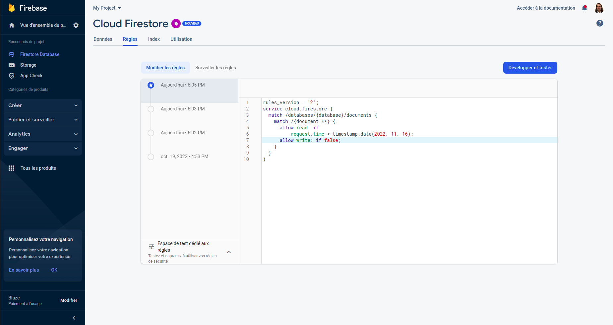
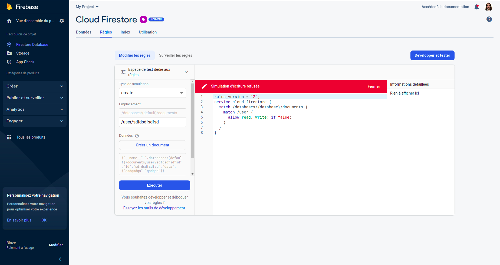
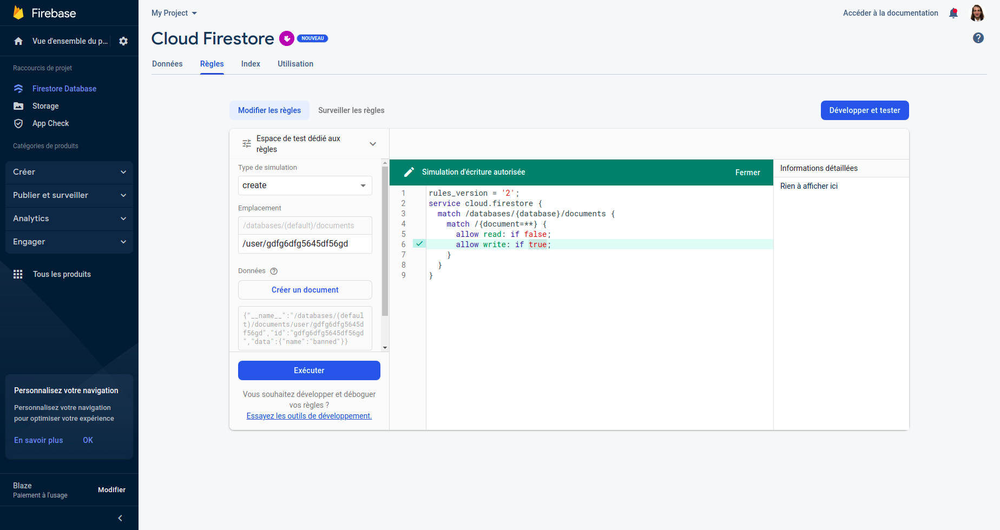

# LABORATORY-FIREBASE

```
$ npm install -g firebase-tools
$ npm install firebase-functions@latest firebase-admin@latest --save
```

```
$ firebase deploy
$ firebase emulators:start
```

```
http://localhost:5001/stoked-brand-140404/us-central1/test
```

<details>
  <summary>Security rules</summary>

#### Examples

    Just a small example of what is possible. In the example below, I authorized only the writing if the name was different from "banned".
    I also tried other scenario such as not authorizing anything, only a part...and so on

- 
- 
- 
- 
</details>
